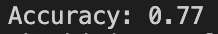

# The Jordan Effect

## Description
For my independent study class in Artifical Intelligence, I built a 2-layered neural network from scratch in Python. My NeuralNetwork class featured two major methods: one that outputted a prediction based on input weights and biases(feed forward) and another that adjusted weights/biases via stochastic gradient descent based on how accurate/inaccurate the network's prediction was(back propagation).

After implementing the neural network, I implemented it in two separate contexts.

The first was the XOR operation, which was intentionally linearly inseparable. The results were as follows (w/10000 epochs and shuffle):


The second application originates from a personal passion of mine: basketball. The neural network took in relevant statistical information about Michael Jordan’s performance(age, home vs. away, points, rebounds, assists, and lineup order) in order to predict whether or not the Bulls won the game. My dataset was relatively small(1072 games), so I randomly used 872 of the data vectors as training data and used the remaining 200 to validate the accuracy of my network. The results were as follows (w/1000 epochs and shuffle):



## Conclusion

The motivating question of this project was determining if Michael Jordan actually was the GOAT(Greatest of All Time). In other words, could I demonstrate a high enough statistical correlation between his individual performance and the team's performance?

The 77% accuracy rate was higher than expected. With a relatively small dataset and the lack of a proven correlation between individual and team performance, the weights calculated by the neural network demonstrated a high correlation between points scored, age and win/loss. Interestingly, the least relevant individual factors for predicting wins/loss were assists and rebounds. In a basketball context, this makes sense- for the Bulls, the primary rebounder was Dennis Rodman and the primary passer was Scottie Pippen. 

Safe to say MJ has a great argument for the greatest of all time.

## Getting Started

The 2-Layered Neural Network can be applied in a variety of contexts. In order to use it, use the following declaration:

```
Sample_Neural_Network = NeuralNetwork(inputNodes, hiddenNodes, outputNodes)
```

Train it as follows:

```
for i in range(len(trainData)):
     Sample_Neural_Network.train(trainData[i], trainTargets[i])
```