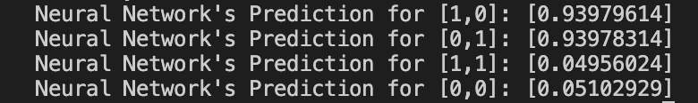

# The-Jordan-Effect

## Description
For my independent study class in Artifical Intelligence, I built a 2-layered neural network from scratch in Python. My NeuralNetwork class featured two major methods: one that outputted a prediction based on input weights and biases(feed forward) and another that adjusted weights via stochastic gradient descent based on how accurate/inaccurate the network's prediction was(back propagation).

After implementing the neural network, I implemented it in two separate contexts.

The first was the XOR operation, which was intentionally linearly inseparable. The results were as follows (w/10000 epochs and shuffle):

The second application was one that originates from a personal passion of mine: basketball. The neural network took in relevant statistical information about Michael Jordan’s performance(age, home vs. away, points, rebounds, assists, and age) in order to predict whether or not the Bulls won the game. My dataset was relatively small(1072 games), so I randomly used 872 of the data vectors as training data and used the remaining 200 to validate the accuracy of my network. The results were as follows (w/1000 epochs and shuffle):

## Conclusion

## Getting Started

Brief description of the Jordan Project: I built a multilayered neural network that took in relevant statistical information about Michael Jordan’s performance(age, home vs. away, points, rebounds, assists, and age) in order to predict whether or not the Bulls won the game. The training data was amassed from online datasets, which I parsed and normalized. 

In my writeup of the project, I interestingly concluded that the least relevant factors were assists and rebounds, which seemed odd at first for a player that nearly averaged a triple double for his career. It was only upon further analysis that I realized that the Bulls’s most successful seasons came when Pippen had a majority of the assists and Rodman had a majority of the rebounds.